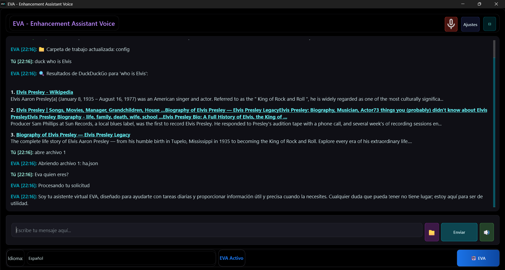

# EVA — Enhanced Voice Assistant


[](https://ko-fi.com/charlyproject)

> **Asistente de voz local para Windows** — reconocimiento de voz offline (Vosk), síntesis de voz natural (Piper TTS) e IA local (Ollama), todo desde una interfaz de chat moderna construida con PySide6.

📖 [English version → README_EN.md](README_EN.md)

---

## ✨ Características principales

| Módulo | Tecnología | Descripción |
|--------|-----------|-------------|
| 🗣️ Reconocimiento de voz | Vosk + VAD | 100 % offline, español e inglés |
| 🔊 Síntesis de voz | Piper TTS | Voces neurales optimizadas para CPU |
| 🤖 IA conversacional | Ollama | Modelos locales, sin API externa |
| 🌍 Bilingüe | — | Interfaz y comandos ES / EN |
| 📁 Gestión de archivos | — | Detección de carpeta activa, apertura, listado |
| 🎮 Control del sistema | — | Volumen, brillo, energía, WiFi, Bluetooth |
| 🎵 Control multimedia | — | VLC, MPC-HC, Kodi |
| 📅 Citas | — | Creación conversacional guiada |
| 🌐 Búsqueda web | DuckDuckGo / Tavily / Google | **Opcional** — requiere internet y/o API key |
| 🎤 Dictado por voz | Vosk | Conversión voz → texto en tiempo real |

> **Nota sobre el modo offline:** el núcleo de EVA (voz, IA, comandos de sistema, citas, archivos) funciona **sin conexión a internet**. Las búsquedas web (comandos `busca`, `web`, `ddg`, `internet`) son opcionales y usan DuckDuckGo (sin clave), Tavily (requiere API key gratuita) o Google. OpenRouter es también opcional para acceder a modelos en la nube.

---

## 📋 Requisitos del sistema

- **Windows 10 / 11** (64-bit)
- **Python 3.11+**
- **Ollama** instalado y ejecutándose → https://ollama.com
- **Micrófono** funcional
- **4 GB RAM** mínimo (8 GB recomendado)
- GPU NVIDIA — opcional (Ollama la detecta automáticamente)

---

## 🚀 Instalación

### 1. Clonar el repositorio

```bash
git clone https://github.com/charlyproject/EVA.git
cd EVA
```

### 2. Crear entorno virtual e instalar dependencias

```bash
python -m venv .venv
.venv\Scripts\activate
pip install -r requirements.txt
```

> **Nota:** PyAudio puede requerir tener instalado el [Visual C++ Redistributable](https://aka.ms/vs/17/release/vc_redist.x64.exe).

### 3. Descargar modelos y binarios externos

Los binarios de Vosk, Piper y FFmpeg **no están incluidos** en el repositorio por su tamaño y licencias propias. Descárgalos de forma automática ejecutando:

```bat
download_models.bat
```

O de forma manual siguiendo las instrucciones en [`requirements_extra.md`](requirements_extra.md).

### 4. Instalar Ollama y descargar un modelo de IA

```bash
# Descargar Ollama desde https://ollama.com e instalarlo, luego:
ollama pull qwen3:4b
```

EVA detecta automáticamente todos los modelos disponibles en Ollama al arrancar.

### 5. Ejecutar

```bash
python main.py
```

En la primera ejecución aparece un asistente de configuración para seleccionar idioma, hardware y modelo de IA.

---

## 🎯 Comandos

Todos los comandos funcionan **por voz y por texto**. Son bilingües (ES / EN).

### IA y conversación

| ES | EN | Descripción |
|---|---|---|
| `eva [pregunta]` | `eva [question]` | Conversar con la IA local |
| `modelo` | `model` | Ver y cambiar modelo Ollama |
| `1`, `2`, `3`... | `1`, `2`, `3`... | Seleccionar modelo por número |

### Sistema

| ES | EN | Descripción |
|---|---|---|
| `sube volumen` | `volume up` | Subir volumen del sistema |
| `baja volumen` | `volume down` | Bajar volumen |
| `silencia` | `mute` | Silenciar / activar |
| `volumen [0-100]` | `volume [0-100]` | Volumen específico |
| `apaga` | `shutdown` | Apagar PC (pide confirmación) |
| `reinicia` | `restart` | Reiniciar (pide confirmación) |
| `captura pantalla` | `screenshot` | Captura de pantalla |
| `salir` | `exit` | Cerrar EVA |

### Archivos

| ES | EN | Descripción |
|---|---|---|
| `lista archivos` | `list files` | Listar carpeta activa |
| `abre [nombre]` | `open [name]` | Abrir programa, carpeta, web o archivo |
| `abre archivo [N]` | `open file [N]` | Abrir archivo por número |

### Multimedia (VLC, MPC-HC, Kodi)

| ES | EN | Descripción |
|---|---|---|
| `pausa` | `pause` | Pausar / reanudar |
| `siguiente` | `next` | Siguiente pista |
| `anterior` | `previous` | Anterior |
| `pantalla completa` | `fullscreen` | Toggle pantalla completa |

### Windows

| ES | EN | Descripción |
|---|---|---|
| `activa wifi` | `enable wifi` | Activar WiFi |
| `desactiva wifi` | `disable wifi` | Desactivar WiFi |
| `activa bluetooth` | `enable bluetooth` | Activar Bluetooth |
| `sube brillo` | `brightness up` | Subir brillo |
| `brillo [0-100]` | `brightness [0-100]` | Brillo específico |

### Búsqueda web (opcional, requiere internet)

| ES | EN | Descripción |
|---|---|---|
| `busca [término]` | `search [term]` | Google |
| `ddg [término]` | `ddg [term]` | DuckDuckGo (sin clave) |
| `web [término]` | `web [term]` | Tavily (requiere API key) |
| `internet [término]` | `internet [term]` | Tavily con fallback a DDG |

### Citas

| ES | EN | Descripción |
|---|---|---|
| `cita` | `appointment` | Crear cita (proceso guiado) |
| `citas` | `appointments` | Ver citas de hoy |
| `citas [fecha]` | `appointments [date]` | Ver citas por fecha |

### Dictado y ayuda

| ES | EN | Descripción |
|---|---|---|
| `dictado` | `dictation` | Iniciar dictado por voz |
| `ayuda` | `help` | Menú de ayuda interactivo |
| `comandos` | `commands` | Lista completa de comandos |
| `wizard` | `setup` | Abrir asistente de configuración |

---

## 🏗️ Arquitectura del proyecto

```
EVA/
├── main.py                    # Punto de entrada principal
├── __version__.py             # Versión de la aplicación
├── requirements.txt           # Dependencias Python
├── styles.qss                 # Estilos Qt (tema visual)
├── download_models.bat        # Descarga binarios/modelos externos
├── requirements_extra.md      # Guía de recursos externos
│
├── config/                    # Configuración
│   ├── paths.json             # Rutas personalizadas
│   ├── lang_es.json           # Textos en español
│   ├── lang_en.json           # Textos en inglés
│   └── eva_knowledge_base.json
│
├── core/                      # Núcleo del sistema
├── commands/                  # Procesamiento de comandos
├── voice/                     # Sistema de voz (Vosk + Piper)
├── ui/                        # Interfaz de usuario (PySide6)
├── utils/                     # Utilidades
├── help_system/               # Sistema de ayuda integrado
├── hooks/                     # Hooks PyInstaller
├── resources/                 # Iconos y recursos visuales
├── tests/                     # Tests
├── screenshots/               # Capturas de pantalla
│
│   ── Descarga separada (download_models.bat) ──
├── piper/                     # Piper TTS (binario + modelos)
├── ffmpeg/                    # FFmpeg (binarios)
└── models/vosk/               # Modelos de reconocimiento de voz
```

---

## ⚙️ Configuración

El panel de configuración es accesible desde el botón ⚙️ en la ventana principal:

- **Apariencia:** Tema oscuro/claro, fuente, tamaño
- **Voz:** Sensibilidad del micrófono, VAD, idioma
- **IA:** Modelo Ollama, temperatura
- **Idioma:** Español / Inglés (cambio en tiempo real)
- **Comandos personalizados:** Programas, carpetas, sitios web

Ejemplo de `config/paths.json`:

```json
{
  "paths": {
    "programs": { "chrome": "C:\\Program Files\\Google\\Chrome\\chrome.exe" },
    "folders":  { "documentos": "C:\\Users\\Usuario\\Documents" },
    "websites": { "youtube": "https://youtube.com" }
  }
}
```

---

## 🐛 Solución de problemas

**El reconocimiento de voz no funciona**
1. Verifica que el micrófono funciona en Windows.
2. Comprueba que los modelos Vosk existen en `models/vosk/` (ejecuta `download_models.bat`).
3. Ajusta la sensibilidad en Configuración → Voz.

**Piper TTS no habla**
1. Verifica que `piper/piper.exe` existe.
2. Verifica que los modelos existen en `piper/models/` (ejecuta `download_models.bat`).
3. Comprueba que el audio no está silenciado en EVA (botón 🔇).

**Ollama no responde**
1. `ollama --version` — verifica instalación.
2. `ollama list` — verifica que hay algún modelo.
3. Si no hay modelo: `ollama pull qwen3:4b`.
4. Reinicia EVA.

---

## 🔨 Compilar el ejecutable (.exe)

```bat
# Build rápido (para pruebas)
build_quick.bat

# Build con instalador completo
build_installer.bat
```

---

## 🤝 Contribuir

1. Haz fork del repositorio.
2. Crea una rama: `git checkout -b feature/mi-mejora`.
3. Haz commit: `git commit -m "feat: descripción"`.
4. Abre un Pull Request.

---

## 📸 Captura de pantalla



---

## ☕ Apoyar el proyecto

Si EVA te resulta útil, puedes invitarme a un café:

[](https://ko-fi.com/charlyproject)

---

## 📄 Licencia

MIT © 2025 cHArLy — ver [LICENSE.txt](LICENSE.txt)

Los componentes de terceros (Vosk, Piper, FFmpeg) tienen sus propias licencias.
Ver [LICENSE.txt](LICENSE.txt) y [requirements_extra.md](requirements_extra.md) para más detalles.
