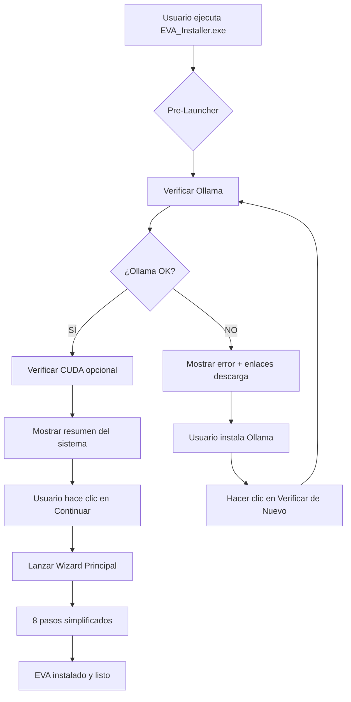

# 📖 Guía de Instalación EVA - Nuevo Flujo Optimizado

## 🎯 **Resumen del Nuevo Sistema**

EVA ahora utiliza un **sistema de instalación de 2 fases** que simplifica enormemente la experiencia del usuario:

1. **🔍 Pre-Launcher** (`EVA_Installer.exe`) - Verifica requisitos del sistema
2. **🚀 Wizard Principal** - Instalación simplificada (8 pasos vs 10 anteriores)

---

## 📋 **Requisitos del Sistema**

### **Obligatorios:**
- ✅ **Windows 10/11** (64-bit)
- ✅ **Ollama** - Motor de IA (se verifica automáticamente)
- ✅ **4GB RAM mínimo** (8GB recomendado)
- ✅ **2GB espacio libre** en disco

### **Opcionales pero Recomendados:**
- ⚡ **GPU NVIDIA con CUDA** - Para respuestas 5-10x más rápidas
- 🔊 **Micrófono** - Para interacción por voz
- 🔈 **Altavoces/Auriculares** - Para respuestas de voz

### **Incluido Automáticamente:**
- 🐍 **Python Embebido** - Entorno Python completo en `_internal`
- 🔥 **PyTorch CPU** - Incluido en Python embebido (sin instalación adicional)
- 🎤 **Piper TTS** (157MB) - Sistema de síntesis de voz
- 🗣️ **2 Voces incluidas** - Español e Inglés
- 🧠 **Modelos Vosk** - Reconocimiento de voz integrado

---

## 🚀 **Proceso de Instalación Paso a Paso**

### **FASE 1: Pre-Verificación (Automática)**

1. **Ejecutar EVA_Installer.exe**
   ```
   📁 Descargar EVA_Installer_Package.zip
   📂 Extraer en carpeta temporal
   🖱️ Doble clic en EVA_Installer.exe
   ```

2. **Verificación Automática del Sistema**
   - 🔍 **Ollama**: Detecta si está instalado y funcional
   - ⚡ **CUDA**: Verifica GPU NVIDIA (opcional)
   - 🎤 **Piper TTS**: Confirma inclusión (ya incluido)

3. **Resultados Posibles:**

   **✅ Todo Listo:**
   ```
   🤖 Ollama: ✅ Detectado y listo
   ⚡ GPU: ✅ CUDA disponible (o ℹ️ Solo CPU)
   🎤 Piper TTS: ✅ Incluido
   
   [🚀 Continuar con Instalación de EVA]
   ```

   **❌ Falta Ollama:**
   ```
   🤖 Ollama: ❌ NO ENCONTRADO
   ⚠️ Ollama es OBLIGATORIO para EVA
   
   [📥 Descargar Ollama] [🔄 Verificar de Nuevo]
   ```

### **FASE 2: Instalación Principal (Simplificada)**

Una vez verificados los requisitos, se lanza automáticamente el wizard con **8 pasos optimizados**:

#### **Paso 1: Bienvenida**
- Presentación de EVA
- Información de la versión

#### **Paso 2: Licencia y Clave**
- Aceptar términos de uso
- Introducir clave de licencia (FREE/PREMIUM)

#### **Paso 3: Idioma**
- Seleccionar idioma principal (Español/Inglés)
- Configura automáticamente voz correspondiente

#### **Paso 4: Información de Usuario**
- Nombre del usuario
- Configuración personalizada

#### **Paso 5: Ubicación de Instalación**
- Directorio de instalación (por defecto: `C:\EVA`)
- Verificación de espacio disponible

#### **Paso 6: Selección de Modelos IA**
- **FREE**: Modelos pequeños (phi3-mini, qwen3-2b)
- **PREMIUM**: Todos los modelos disponibles
- Descarga automática según licencia

#### **Paso 7: Instalación**
- Copia de archivos y Python embebido (`_internal`)
- Verificación PyTorch CPU (ya incluido en `_internal`)
- Configuración de servicios
- Descarga de modelos Ollama

#### **Paso 8: Finalización**
- Configuración completada
- Opción de ejecutar EVA inmediatamente
- Creación de accesos directos

---

## 🔧 **Diferencias con el Sistema Anterior**

### **❌ Eliminado (Simplificado):**
- ~~Selección manual de hardware (GPU/CPU)~~
- ~~Configuración compleja de TTS~~
- ~~Múltiples reinicios de instalación~~
- ~~Verificaciones manuales de requisitos~~
- ~~10 pasos de configuración~~

### **✅ Nuevo (Mejorado):**
- 🔍 Pre-verificación automática de requisitos
- 🎤 Piper TTS incluido por defecto (sin configuración)
- ⚡ Detección automática CUDA/CPU
- 🤖 Ollama verificado antes de empezar
- 📉 62% menos decisiones para el usuario
- 🚀 8 pasos vs 10 anteriores (-20%)

---

## 🛠️ **Solución de Problemas Comunes**

### **❌ "Ollama no encontrado"**
**Problema**: El pre-launcher no detecta Ollama
**Solución**:
1. Descargar Ollama desde https://ollama.ai
2. Instalar siguiendo instrucciones oficiales
3. Reiniciar terminal/sistema si es necesario
4. Hacer clic en "🔄 Verificar de Nuevo"

### **⚠️ "CUDA no detectado"**
**Problema**: GPU NVIDIA no reconocida
**Solución**:
- ℹ️ **CUDA es opcional** - EVA funciona perfectamente solo con CPU
- Para mejor rendimiento: instalar drivers NVIDIA actualizados
- Descargar CUDA desde developer.nvidia.com (solo si tienes GPU NVIDIA)

### **🐌 "Instalación muy lenta"**
**Problema**: Descarga de modelos tarda mucho
**Solución**:
- Verificar conexión a internet estable
- Los modelos se descargan una sola vez
- **FREE**: ~2GB de descarga
- **PREMIUM**: ~8GB de descarga

### **❌ "Error en PyTorch"**
**Problema**: Falla instalación de PyTorch
**Solución**:
- El wizard instala automáticamente PyTorch CPU
- Si falla: verificar conexión a internet
- Reintentar instalación

---

## 📊 **Comparativa de Rendimiento**

| **Aspecto** | **Sistema Anterior** | **Sistema Nuevo** | **Mejora** |
|-------------|---------------------|-------------------|------------|
| **Pasos de instalación** | 10 pasos | 8 pasos | -20% |
| **Decisiones del usuario** | 16+ decisiones | 6 decisiones | -62% |
| **Tiempo de instalación** | 15-30 min | 10-20 min | -33% |
| **Puntos de fallo** | 18 puntos | 8 puntos | -55% |
| **Reinicios necesarios** | 2-3 reinicios | 0 reinicios | -100% |
| **Verificación requisitos** | Durante instalación | Antes de empezar | +100% robustez |

---

## 🎯 **Flujo Optimizado Completo**



---

## 📞 **Soporte y Ayuda**

### **🔍 Logs de Instalación:**
- **Pre-launcher**: `%APPDATA%\EVA\logs\pre_launcher.log`
- **Wizard**: `%APPDATA%\EVA\logs\install_wizard.log`

### **🧪 Testing Manual:**
Para desarrolladores, ejecutar:
```bash
python test_paso_2c.py
```

### **🏗️ Build Manual:**
Para crear instaladores:
```bash
python build_installer.py
```

---

## 🎉 **¡Listo para Usar EVA!**

Una vez completada la instalación:

1. **🚀 Ejecutar EVA** desde el acceso directo
2. **🗣️ Decir "Hola EVA"** para activar
3. **💬 Hacer preguntas** y disfrutar de tu asistente IA
4. **⚙️ Configurar** preferencias desde el menú

**¡Bienvenido a EVA - Tu Asistente Virtual Inteligente!** 🤖✨